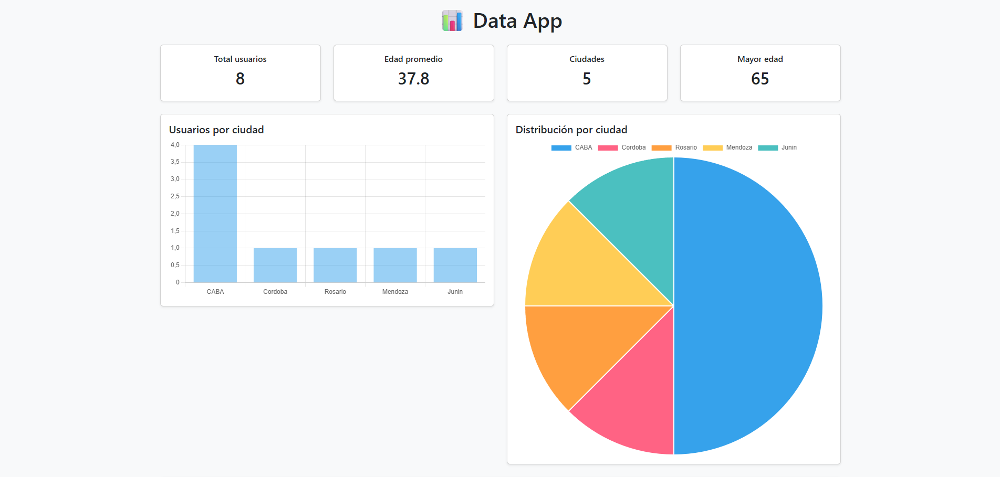
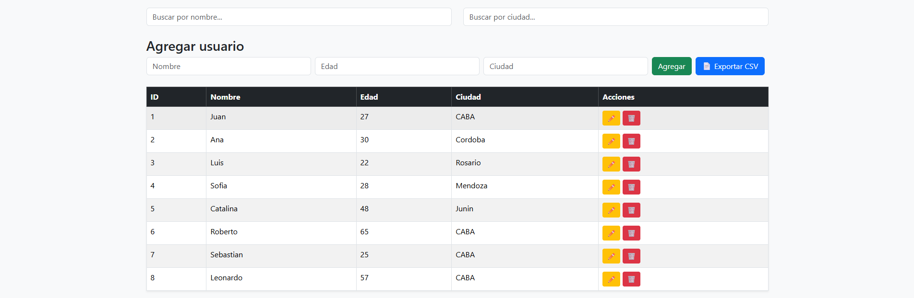
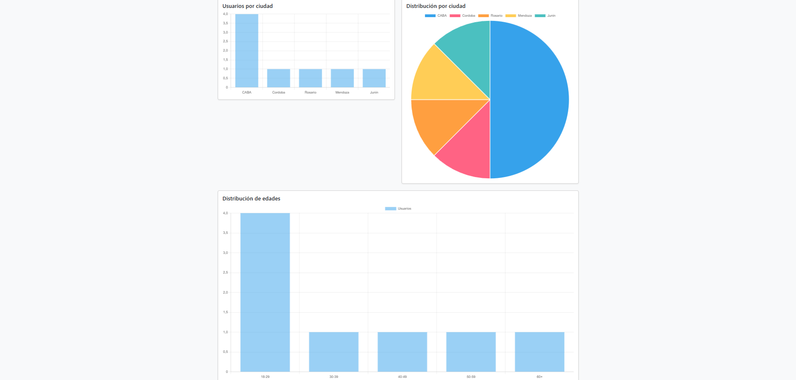
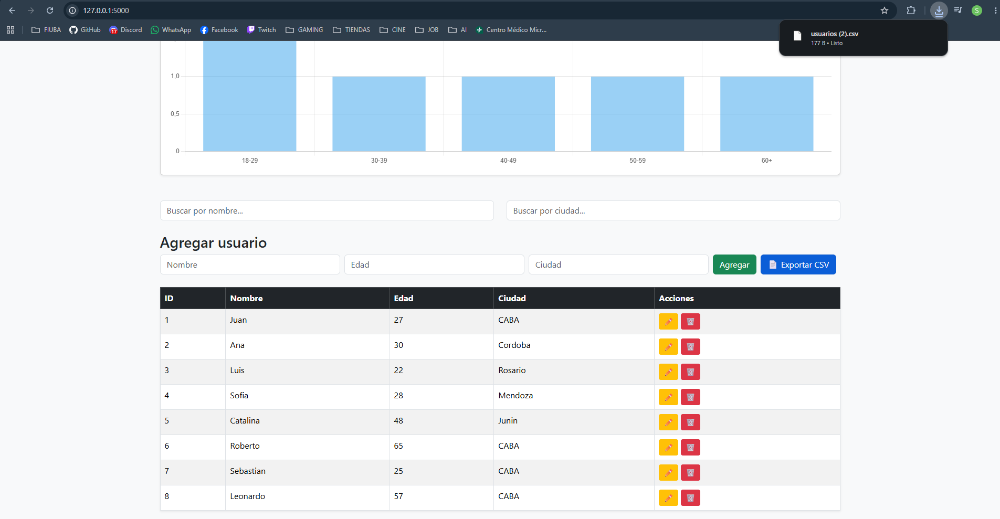

# Proyecto Data App

Aplicación web desarrollada con Python y Flask para gestionar y visualizar datos de usuarios.



## Tecnologías

- Python
- Flask
- SQLite
- Pandas
- SQLAlchemy
- HTML
- JavaScript

## Funcionalidades actuales

- API REST con Flask
- Base de datos SQLite
- Visualización dinámica de usuarios
- Búsqueda por nombre
- Búsqueda por ciudad
- Creacion de usuarios desde la interfaz
- Eliminar un usuario desde la interfaz
- Editar los datos de un usuario desde la interfaz
- Dashboard con estadísticas
- Gráficos interactivos
- Ordenamiento ascendente o descendente por columna
- Exportacion de CSV

## Próximas mejoras

- Exportación a Excel
- Deploy de la aplicación

## Instalación

Clonar el repositorio:

```bash
git clone https://github.com/Sebayur/proyecto-data-app.git
```

Entrar a la carpeta:

```bash
cd proyecto-data-app
```

Crear un entorno virtual:

### Windows

```bash
python -m venv .venv
```

Activarlo:

```bash
.venv\Scripts\activate
```

Instalar las dependencias:

```bash
pip install -r requirements.txt
```

---

## Ejecutar la aplicación

Si la base de datos todavía no existe:

```bash
python crear_db.py
```

Luego iniciar Flask:

```bash
python app.py
```

Abrir el navegador en:

```
http://127.0.0.1:5000
```

## Capturas

## Dashboard principal

Vista principal de la aplicación.


## Gestión de usuarios

Agregar, editar y eliminar usuarios.



## Estadísticas

Gráficos generados automáticamente.



## Exportación CSV

Exportación de la información.



## Autor

**Sebastian Yurtgulu**

Estudiante de Ingeniería Informática (FIUBA)